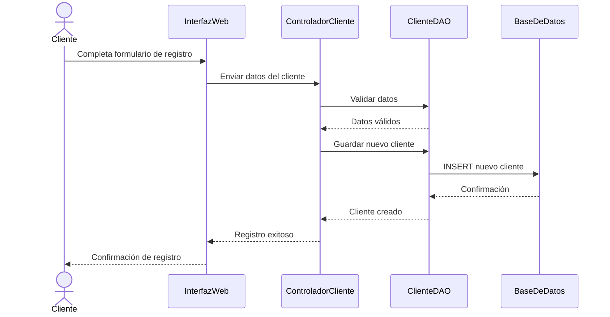

```mermaid
sequenceDiagram
    actor Cliente
    participant InterfazWeb
    participant ControladorCliente
    participant ClienteDAO
    participant BaseDeDatos

    Cliente->>InterfazWeb: Completa formulario de registro
    InterfazWeb->>ControladorCliente: Enviar datos del cliente
    ControladorCliente->>ClienteDAO: Validar datos
    ClienteDAO-->>ControladorCliente: Datos válidos
    ControladorCliente->>ClienteDAO: Guardar nuevo cliente
    ClienteDAO->>BaseDeDatos: INSERT nuevo cliente
    BaseDeDatos-->>ClienteDAO: Confirmación
    ClienteDAO-->>ControladorCliente: Cliente creado
    ControladorCliente-->>InterfazWeb: Registro exitoso
    InterfazWeb-->>Cliente: Confirmación de registro
```
