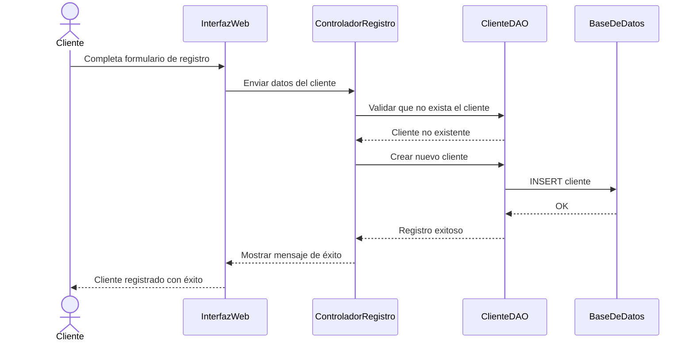

```mermaid
sequenceDiagram
    actor Cliente
    participant InterfazWeb
    participant ControladorRegistro
    participant ClienteDAO
    participant BaseDeDatos

    Cliente->>InterfazWeb: Completa formulario de registro
    InterfazWeb->>ControladorRegistro: Enviar datos del cliente
    ControladorRegistro->>ClienteDAO: Validar que no exista el cliente
    ClienteDAO-->>ControladorRegistro: Cliente no existente
    ControladorRegistro->>ClienteDAO: Crear nuevo cliente
    ClienteDAO->>BaseDeDatos: INSERT cliente
    BaseDeDatos-->>ClienteDAO: OK
    ClienteDAO-->>ControladorRegistro: Registro exitoso
    ControladorRegistro-->>InterfazWeb: Mostrar mensaje de éxito
    InterfazWeb-->>Cliente: Cliente registrado con éxito
```