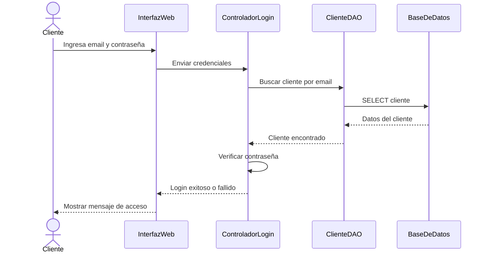

```mermaid
sequenceDiagram
    actor Cliente
    participant InterfazWeb
    participant ControladorLogin
    participant ClienteDAO
    participant BaseDeDatos

    Cliente->>InterfazWeb: Ingresa email y contraseña
    InterfazWeb->>ControladorLogin: Enviar credenciales
    ControladorLogin->>ClienteDAO: Buscar cliente por email
    ClienteDAO->>BaseDeDatos: SELECT cliente
    BaseDeDatos-->>ClienteDAO: Datos del cliente
    ClienteDAO-->>ControladorLogin: Cliente encontrado
    ControladorLogin->>ControladorLogin: Verificar contraseña
    ControladorLogin-->>InterfazWeb: Login exitoso o fallido
    InterfazWeb-->>Cliente: Mostrar mensaje de acceso
```
