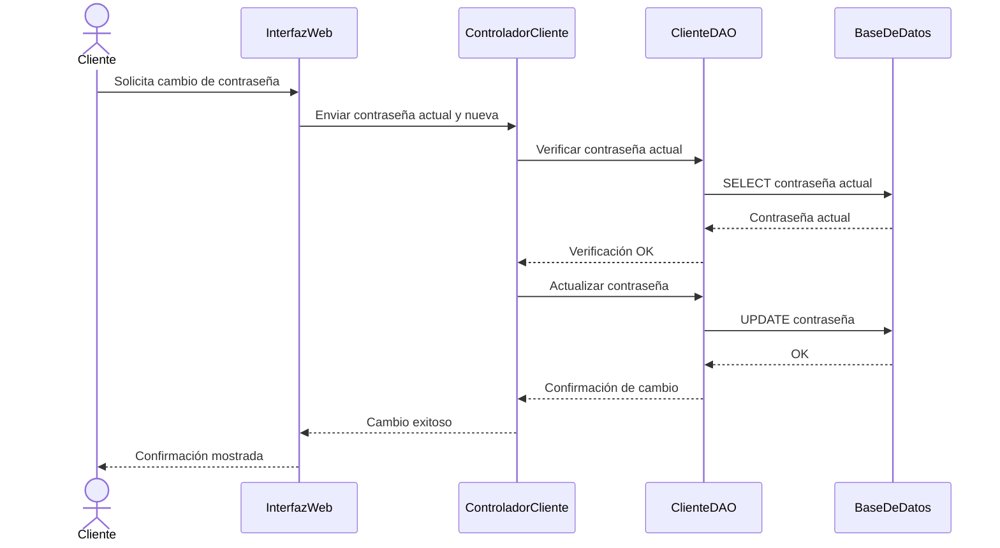

```mermaid
sequenceDiagram
    actor Cliente
    participant InterfazWeb
    participant ControladorCliente
    participant ClienteDAO
    participant BaseDeDatos

    Cliente->>InterfazWeb: Solicita cambio de contraseña
    InterfazWeb->>ControladorCliente: Enviar contraseña actual y nueva
    ControladorCliente->>ClienteDAO: Verificar contraseña actual
    ClienteDAO->>BaseDeDatos: SELECT contraseña actual
    BaseDeDatos-->>ClienteDAO: Contraseña actual
    ClienteDAO-->>ControladorCliente: Verificación OK
    ControladorCliente->>ClienteDAO: Actualizar contraseña
    ClienteDAO->>BaseDeDatos: UPDATE contraseña
    BaseDeDatos-->>ClienteDAO: OK
    ClienteDAO-->>ControladorCliente: Confirmación de cambio
    ControladorCliente-->>InterfazWeb: Cambio exitoso
    InterfazWeb-->>Cliente: Confirmación mostrada
```
