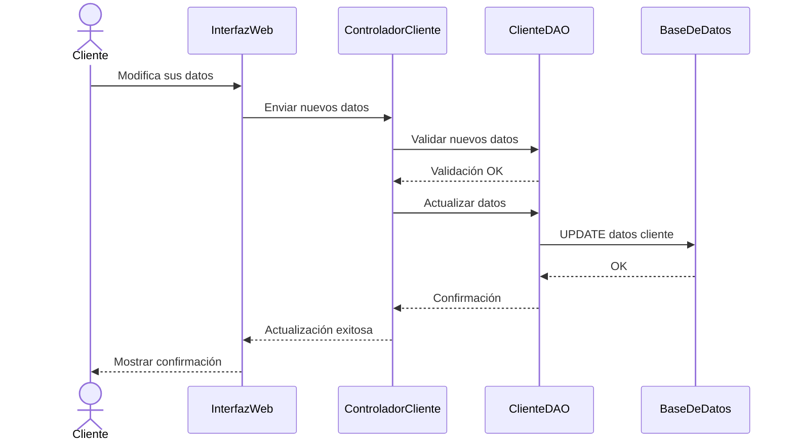

```mermaid
sequenceDiagram
    actor Cliente
    participant InterfazWeb
    participant ControladorCliente
    participant ClienteDAO
    participant BaseDeDatos

    Cliente->>InterfazWeb: Modifica sus datos
    InterfazWeb->>ControladorCliente: Enviar nuevos datos
    ControladorCliente->>ClienteDAO: Validar nuevos datos
    ClienteDAO-->>ControladorCliente: Validación OK
    ControladorCliente->>ClienteDAO: Actualizar datos
    ClienteDAO->>BaseDeDatos: UPDATE datos cliente
    BaseDeDatos-->>ClienteDAO: OK
    ClienteDAO-->>ControladorCliente: Confirmación
    ControladorCliente-->>InterfazWeb: Actualización exitosa
    InterfazWeb-->>Cliente: Mostrar confirmación
```
