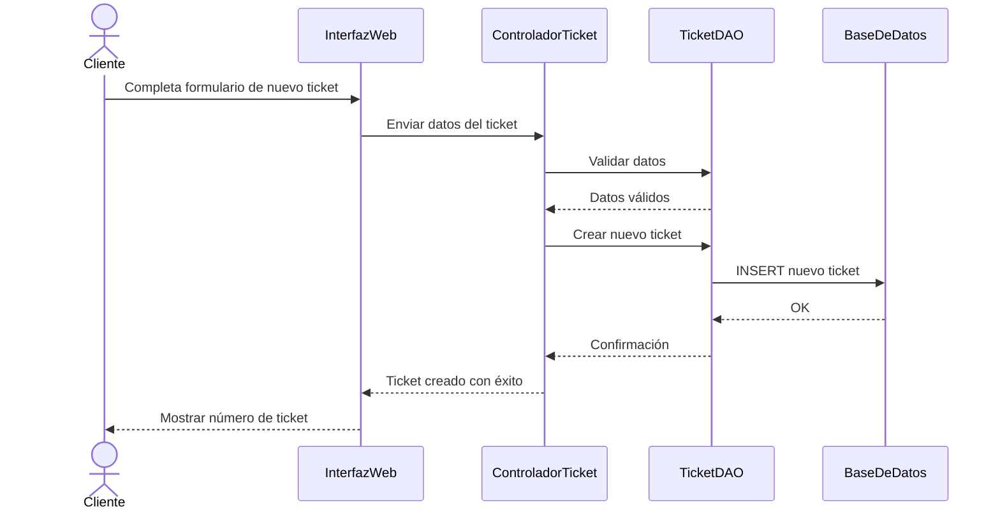

```mermaid
sequenceDiagram
    actor Cliente
    participant InterfazWeb
    participant ControladorTicket
    participant TicketDAO
    participant BaseDeDatos

    Cliente->>InterfazWeb: Completa formulario de nuevo ticket
    InterfazWeb->>ControladorTicket: Enviar datos del ticket
    ControladorTicket->>TicketDAO: Validar datos
    TicketDAO-->>ControladorTicket: Datos válidos
    ControladorTicket->>TicketDAO: Crear nuevo ticket
    TicketDAO->>BaseDeDatos: INSERT nuevo ticket
    BaseDeDatos-->>TicketDAO: OK
    TicketDAO-->>ControladorTicket: Confirmación
    ControladorTicket-->>InterfazWeb: Ticket creado con éxito
    InterfazWeb-->>Cliente: Mostrar número de ticket
```
