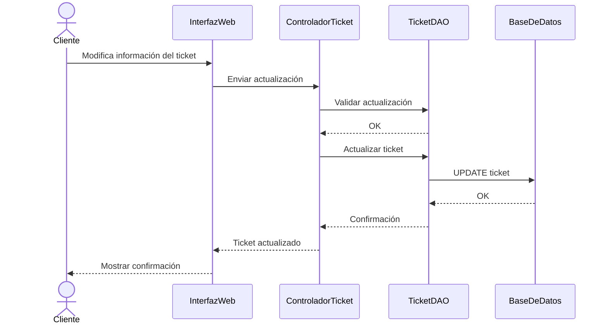

```mermaid
sequenceDiagram
    actor Cliente
    participant InterfazWeb
    participant ControladorTicket
    participant TicketDAO
    participant BaseDeDatos

    Cliente->>InterfazWeb: Modifica información del ticket
    InterfazWeb->>ControladorTicket: Enviar actualización
    ControladorTicket->>TicketDAO: Validar actualización
    TicketDAO-->>ControladorTicket: OK
    ControladorTicket->>TicketDAO: Actualizar ticket
    TicketDAO->>BaseDeDatos: UPDATE ticket
    BaseDeDatos-->>TicketDAO: OK
    TicketDAO-->>ControladorTicket: Confirmación
    ControladorTicket-->>InterfazWeb: Ticket actualizado
    InterfazWeb-->>Cliente: Mostrar confirmación
```
