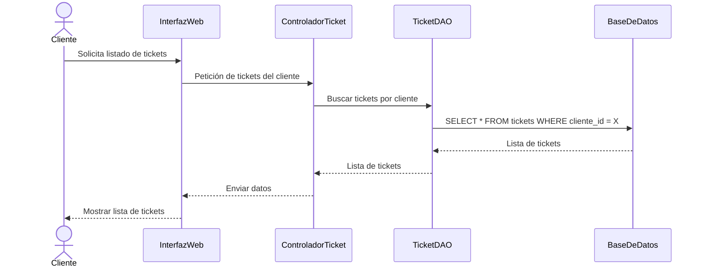

```mermaid
sequenceDiagram
    actor Cliente
    participant InterfazWeb
    participant ControladorTicket
    participant TicketDAO
    participant BaseDeDatos

    Cliente->>InterfazWeb: Solicita listado de tickets
    InterfazWeb->>ControladorTicket: Petición de tickets del cliente
    ControladorTicket->>TicketDAO: Buscar tickets por cliente
    TicketDAO->>BaseDeDatos: SELECT * FROM tickets WHERE cliente_id = X
    BaseDeDatos-->>TicketDAO: Lista de tickets
    TicketDAO-->>ControladorTicket: Lista de tickets
    ControladorTicket-->>InterfazWeb: Enviar datos
    InterfazWeb-->>Cliente: Mostrar lista de tickets
```
