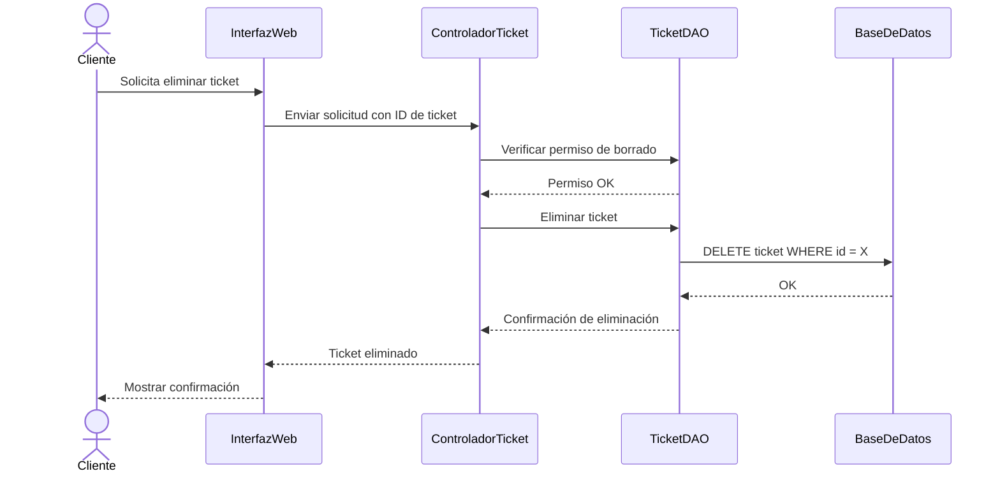

```mermaid
sequenceDiagram
    actor Cliente
    participant InterfazWeb
    participant ControladorTicket
    participant TicketDAO
    participant BaseDeDatos

    Cliente->>InterfazWeb: Solicita eliminar ticket
    InterfazWeb->>ControladorTicket: Enviar solicitud con ID de ticket
    ControladorTicket->>TicketDAO: Verificar permiso de borrado
    TicketDAO-->>ControladorTicket: Permiso OK
    ControladorTicket->>TicketDAO: Eliminar ticket
    TicketDAO->>BaseDeDatos: DELETE ticket WHERE id = X
    BaseDeDatos-->>TicketDAO: OK
    TicketDAO-->>ControladorTicket: Confirmación de eliminación
    ControladorTicket-->>InterfazWeb: Ticket eliminado
    InterfazWeb-->>Cliente: Mostrar confirmación
```
