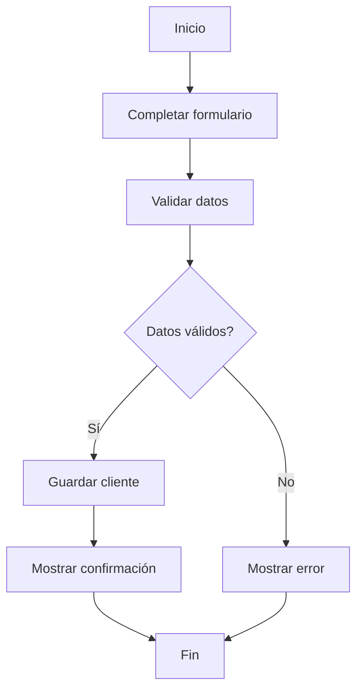

```mermaid
    flowchart TD
        A[Inicio] --> B[Completar formulario]
        B --> C[Validar datos]
        C --> D{Datos válidos?}
        D -- Sí --> E[Guardar cliente]
        E --> F[Mostrar confirmación]
        F --> G[Fin]
        D -- No --> H[Mostrar error]
        H --> G
```
