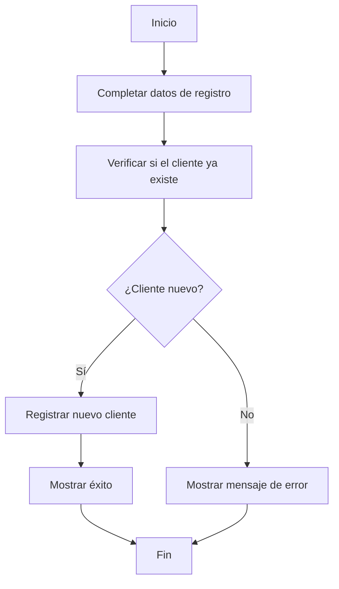

```mermaid
flowchart TD
    A[Inicio] --> B[Completar datos de registro]
    B --> C[Verificar si el cliente ya existe]
    C --> D{¿Cliente nuevo?}
    D -- Sí --> E[Registrar nuevo cliente]
    E --> F[Mostrar éxito]
    F --> G[Fin]
    D -- No --> H[Mostrar mensaje de error]
    H --> G
```
