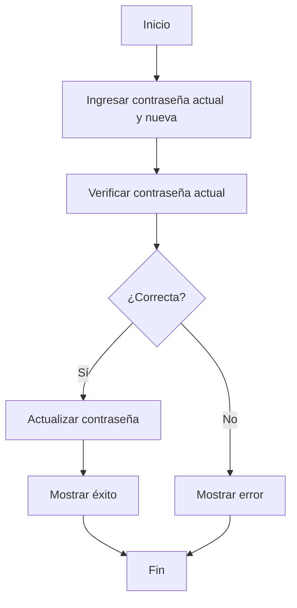

```mermaid
flowchart TD
    A[Inicio] --> B[Ingresar contraseña actual y nueva]
    B --> C[Verificar contraseña actual]
    C --> D{¿Correcta?}
    D -- Sí --> E[Actualizar contraseña]
    E --> F[Mostrar éxito]
    F --> G[Fin]
    D -- No --> H[Mostrar error]
    H --> G
```
