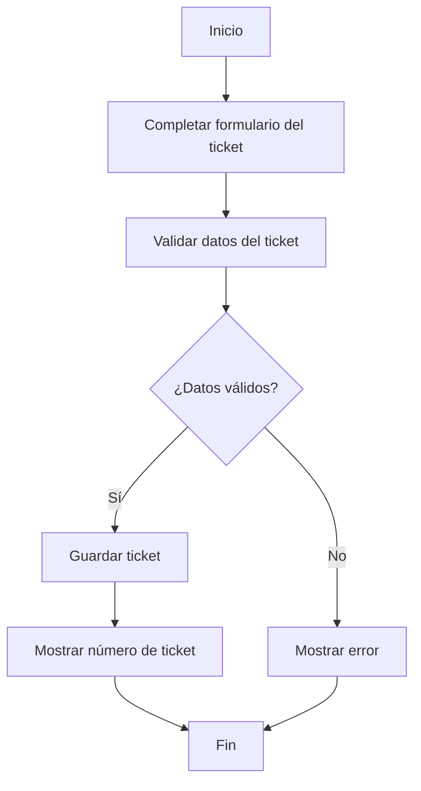

```mermaid
flowchart TD
    A[Inicio] --> B[Completar formulario del ticket]
    B --> C[Validar datos del ticket]
    C --> D{¿Datos válidos?}
    D -- Sí --> E[Guardar ticket]
    E --> F[Mostrar número de ticket]
    F --> G[Fin]
    D -- No --> H[Mostrar error]
    H --> G
```
