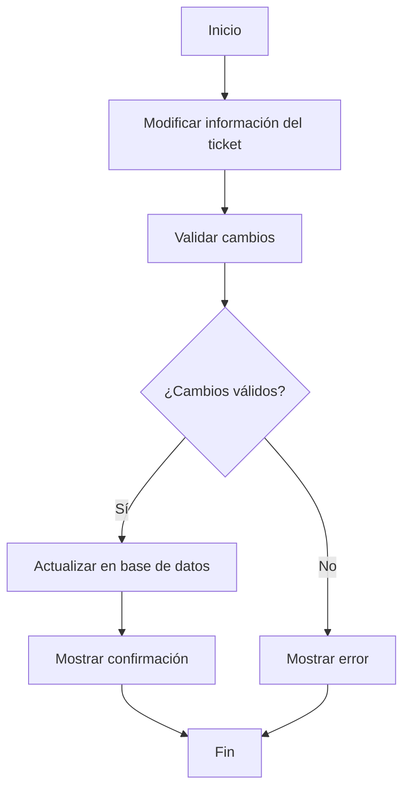

```mermaid
flowchart TD
    A[Inicio] --> B[Modificar información del ticket]
    B --> C[Validar cambios]
    C --> D{¿Cambios válidos?}
    D -- Sí --> E[Actualizar en base de datos]
    E --> F[Mostrar confirmación]
    F --> G[Fin]
    D -- No --> H[Mostrar error]
    H --> G
```
