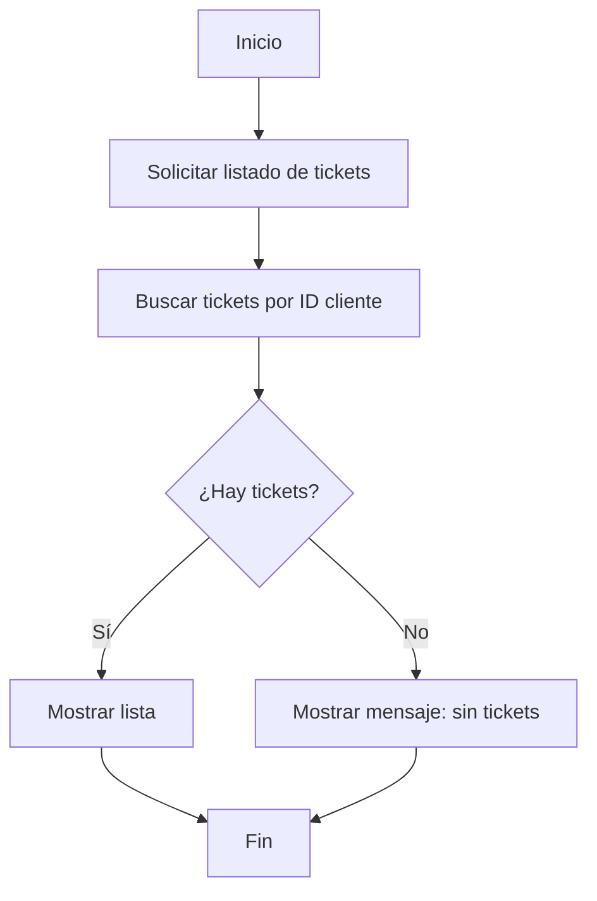

```mermaid
flowchart TD
    A[Inicio] --> B[Solicitar listado de tickets]
    B --> C[Buscar tickets por ID cliente]
    C --> D{¿Hay tickets?}
    D -- Sí --> E[Mostrar lista]
    D -- No --> F[Mostrar mensaje: sin tickets]
    E --> G[Fin]
    F --> G
```
