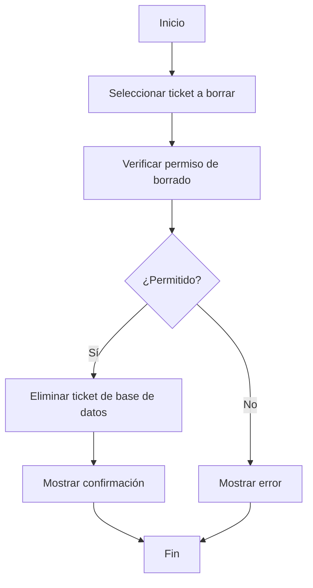

```mermaid
flowchart TD
    A[Inicio] --> B[Seleccionar ticket a borrar]
    B --> C[Verificar permiso de borrado]
    C --> D{¿Permitido?}
    D -- Sí --> E[Eliminar ticket de base de datos]
    E --> F[Mostrar confirmación]
    F --> G[Fin]
    D -- No --> H[Mostrar error]
    H --> G
```
