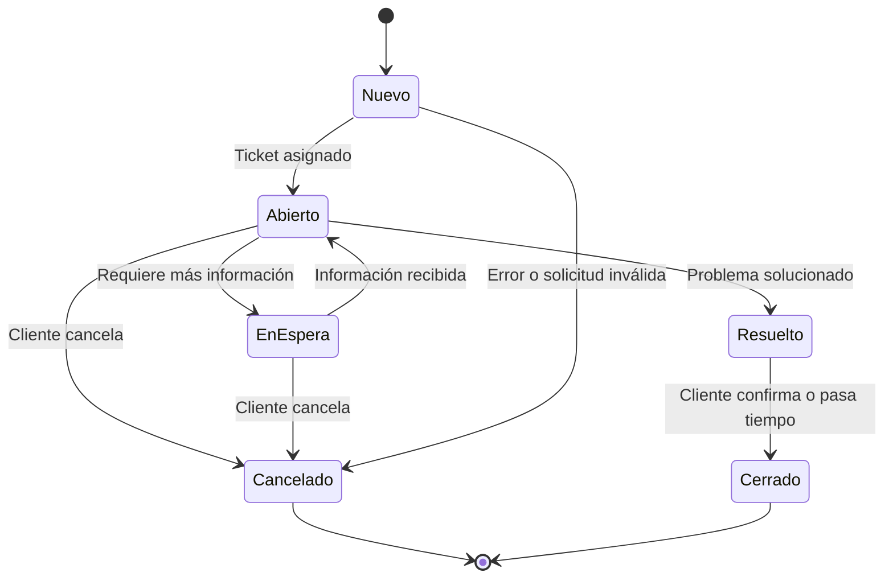

```mermaid
stateDiagram-v2
    [*] --> Nuevo

    Nuevo --> Abierto: Ticket asignado
    Abierto --> EnEspera: Requiere más información
    EnEspera --> Abierto: Información recibida
    Abierto --> Resuelto: Problema solucionado
    Resuelto --> Cerrado: Cliente confirma o pasa tiempo
    Abierto --> Cancelado: Cliente cancela
    EnEspera --> Cancelado: Cliente cancela
    Nuevo --> Cancelado: Error o solicitud inválida
    Cancelado --> [*]
    Cerrado --> [*]
```
