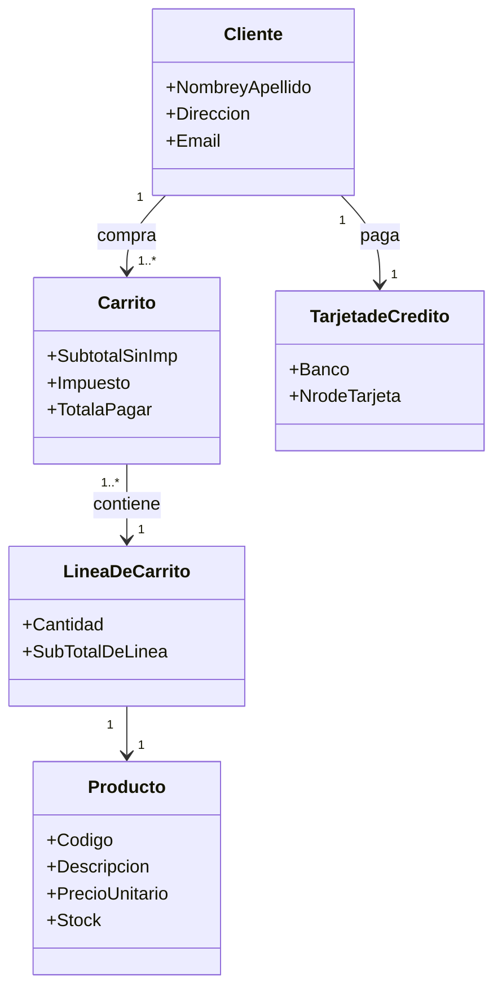

```mermaid
    classDiagram

    %% Clases
    class Cliente {
    +NombreyApellido
    +Direccion
    +Email
    }

    class Carrito {
    +SubtotalSinImp
    +Impuesto
    +TotalaPagar
    }

    class LineaDeCarrito {
    +Cantidad
    +SubTotalDeLinea
    }

    class Producto {
    +Codigo
    +Descripcion
    +PrecioUnitario
    +Stock
    }

    class TarjetadeCredito {
    +Banco
    +NrodeTarjeta
    }

    %% Relaciones
    Cliente "1" --> "1..*" Carrito : compra
    Carrito "1..*" --> "1" LineaDeCarrito : contiene
    LineaDeCarrito "1" --> "1" Producto
    Cliente "1" --> "1" TarjetadeCredito : paga
```