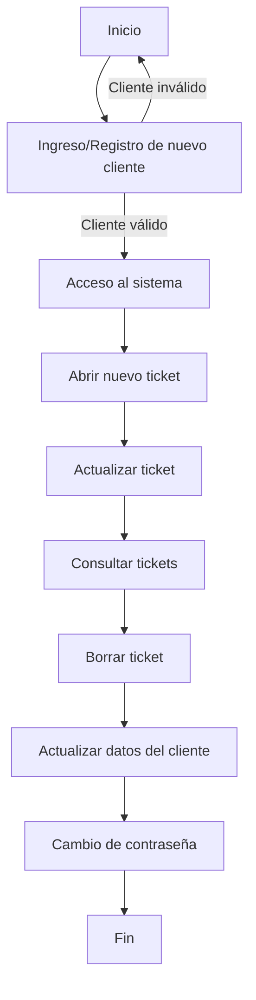

```mermaid
flowchart TD
    A[Inicio] --> B[Ingreso/Registro de nuevo cliente]
    B -->|Cliente válido| C[Acceso al sistema]
    B -->|Cliente inválido| A
    C --> D[Abrir nuevo ticket]
    D --> E[Actualizar ticket]
    E --> F[Consultar tickets]
    F --> G[Borrar ticket]
    G --> H[Actualizar datos del cliente]
    H --> I[Cambio de contraseña]
    I --> Z[Fin]
```