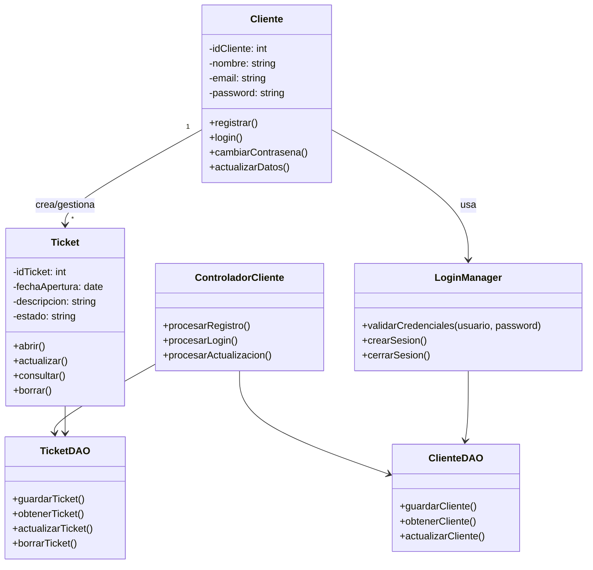

```mermaid
%%{init: {'theme': 'default'}}%%
classDiagram
    class Cliente {
        -idCliente: int
        -nombre: string
        -email: string
        -password: string
        +registrar()
        +login()
        +cambiarContrasena()
        +actualizarDatos()
    }

    class Ticket {
        -idTicket: int
        -fechaApertura: date
        -descripcion: string
        -estado: string
        +abrir()
        +actualizar()
        +consultar()
        +borrar()
    }

    class LoginManager {
        +validarCredenciales(usuario, password)
        +crearSesion()
        +cerrarSesion()
    }

    class ControladorCliente {
        +procesarRegistro()
        +procesarLogin()
        +procesarActualizacion()
    }

    class ClienteDAO {
        +guardarCliente()
        +obtenerCliente()
        +actualizarCliente()
    }

    class TicketDAO {
        +guardarTicket()
        +obtenerTicket()
        +actualizarTicket()
        +borrarTicket()
    }

    Cliente "1" --> "*" Ticket : crea/gestiona
    Cliente --> LoginManager : usa
    ControladorCliente --> ClienteDAO
    ControladorCliente --> TicketDAO
    LoginManager --> ClienteDAO
    Ticket --> TicketDAO
```