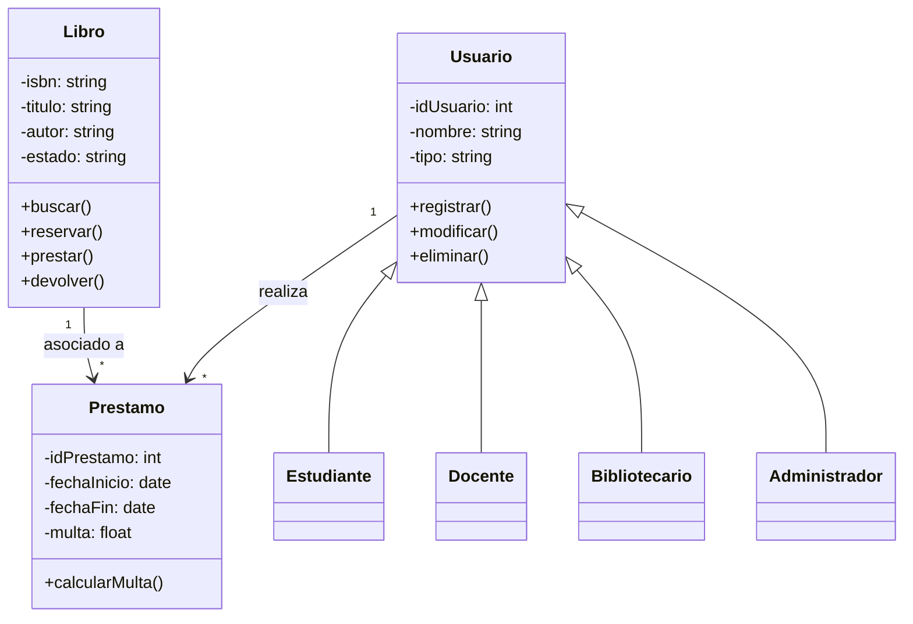

```mermaid
%%{init: {'theme': 'default'}}%%
classDiagram
    class Libro {
        -isbn: string
        -titulo: string
        -autor: string
        -estado: string
        +buscar()
        +reservar()
        +prestar()
        +devolver()
    }

    class Usuario {
        -idUsuario: int
        -nombre: string
        -tipo: string
        +registrar()
        +modificar()
        +eliminar()
    }

    class Estudiante {
    }

    class Docente {
    }

    class Bibliotecario {
    }

    class Administrador {
    }

    class Prestamo {
        -idPrestamo: int
        -fechaInicio: date
        -fechaFin: date
        -multa: float
        +calcularMulta()
    }

    Usuario <|-- Estudiante
    Usuario <|-- Docente
    Usuario <|-- Bibliotecario
    Usuario <|-- Administrador

    Libro "1" --> "*" Prestamo : asociado a
    Usuario "1" --> "*" Prestamo : realiza

```