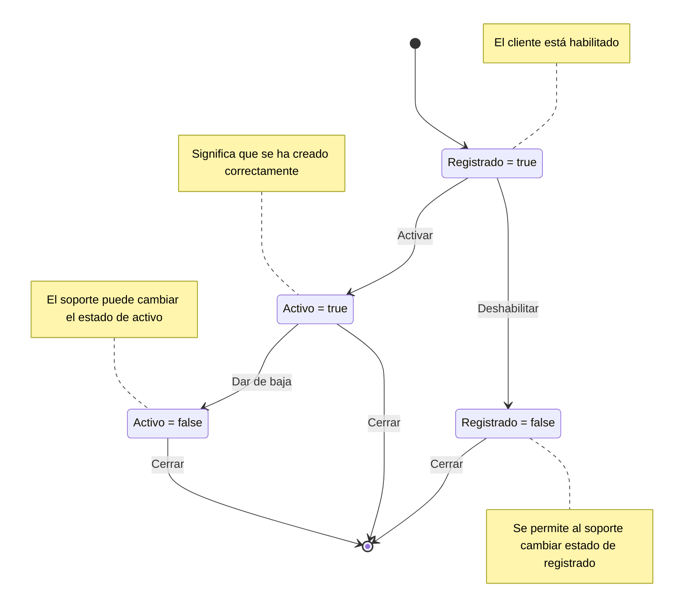

```mermaid
stateDiagram
direction TB
[*] --> Still
Still --> s1:Activar
Still --> s2:Deshabilitar
s1 --> s3:Dar de baja
s3 --> [*]:Cerrar
s1 --> [*]:Cerrar
s2 --> [*]:Cerrar
Still:Registrado = true
s1:Activo = true
s2:Registrado = false
s3:Activo = false
note left of Still : El cliente está habilitado
note right of s2 : Se permite al soporte cambiar estado de registrado
note left of s3 : El soporte puede cambiar el estado de activo
note left of s1 : Significa que se ha creado correctamente
```